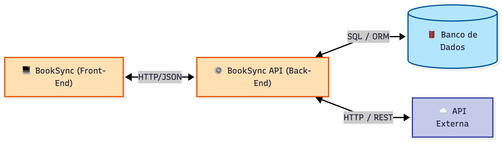

# 📚 BookSync - Frontend

**BookSync** é uma aplicação web do tipo SPA (Single Page Application) desenvolvida com HTML, CSS e JavaScript puro (Vanilla). Ela atua como interface para o sistema de gestão de livros, conectando-se a uma API própria (Backend) para autenticação e persistência, e indiretamente à API do Google Books para busca de títulos.

---

## 🏛️ Arquitetura do Projeto

O projeto segue a arquitetura de **API Gateway/Proxy (Cenário 1.1)**, onde o Backend centraliza a comunicação com o banco de dados e serviços externos.



*(O Front-end comunica-se exclusivamente com a API Principal, garantindo segurança e tratamento de dados no servidor).*

---

## 🔧 Tecnologias Utilizadas

- **Linguagem:** JavaScript (ES6+)
- **Estilização:** CSS3 (Variáveis CSS, Flexbox/Grid)
- **Estrutura:** HTML5 Semântico
- **Servidor Web:** Nginx (via Docker)
- **Containerização:** Docker & Docker Compose

---

## 💡 Funcionalidades

- **Autenticação:** Registro, Login e Logout (com expiração automática de JWT).
- **Busca:** Pesquisa integrada à Google Books API (via Backend).
- **Gestão:** Adicionar livros à estante com status "Lido" ou "Lendo".
- **Avaliação:** Sistema de notas (1-5 estrelas) e comentários.
- **Dashboard:** Visualização e edição rápida dos livros salvos.
- **Roteamento:** Navegação SPA via Hash (`#home`, `#dashboard`, `#login`).

---

## 🚀 Como Rodar o Projeto

Você pode executar o projeto de duas formas: usando **Docker (Recomendado)** ou manualmente.

### Pré-requisitos
- [Docker](https://www.docker.com/) instalado.
- Backend rodando (veja instrução abaixo).

### Opção 1: Rodar com Docker Compose (Full Stack) 🐳

Esta opção sobe tanto o Frontend quanto o Backend automaticamente. Certifique-se de estar na raiz deste repositório.

1. Execute o comando:
   ```bash
   docker-compose up
   ```
O Docker irá:

Construir a imagem do Frontend localmente.

Baixar a imagem do Backend (maiagripp/booksync-api) do Docker Hub.

Acesse a aplicação em: http://localhost:8080

### Opção 2: Rodar Apenas o Frontend no Docker

Caso o backend já esteja rodando em outro lugar (ex: localhost:5000), você pode containerizar apenas o front:

Construa a imagem:

```bash
docker build -t booksync-front .
```
Execute o container:

```bash
docker run -p 8080:80 booksync-front
```
Acesse em: http://localhost:8080

### Opção 3: Rodar Manualmente (Sem Docker)
Clone o repositório:

```bash
git clone https://github.com/maiagripp/booksync-front
cd booksync-front
````

Certifique-se que a API está rodando na porta 5000.

Abra o arquivo index.html no seu navegador ou use uma extensão como Live Server.

📁 Estrutura de Arquivos
```Plaintext

📦 booksync-front
 ┣ 📂 images/             # Imagens e recursos estáticos
 ┃ ┗ 📜 architecture.png  # Diagrama da arquitetura
 ┣ 📜 index.html          # Estrutura principal (SPA)
 ┣ 📜 styles.css          # Estilos globais
 ┣ 📜 app.js              # Lógica da aplicação (Fetch/Rotas)
 ┣ 📜 Dockerfile          # Configuração da imagem Nginx
 ┣ 📜 docker-compose.yml  # Orquestração (Front + Back)
 ┗ 📜 README.md           # Documentação
```

🔗 Integração com Backend
Este projeto depende da API BookSync para funcionar.

Repositório da API: [booksync-api](https://github.com/maiagripp/booksync-api)

Imagem Docker da API: maiagripp/booksync-api:latest

📧 Contato
Claudia Maia — Email-me

Projeto desenvolvido como MVP para pós-graduação em Engenharia de Software - Sprint Desenvolvimento FullStack Básico na PUC-Rio.